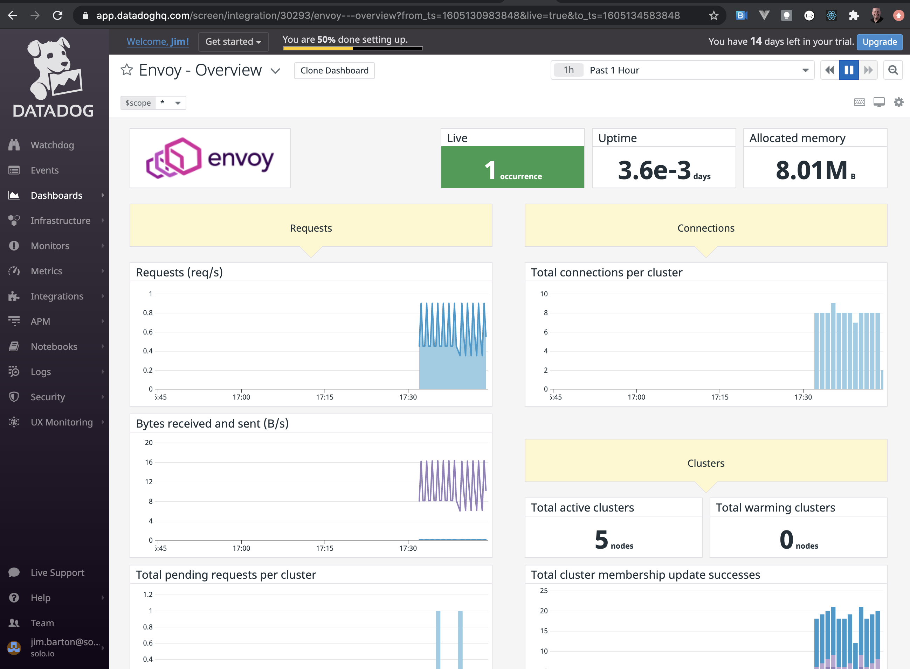
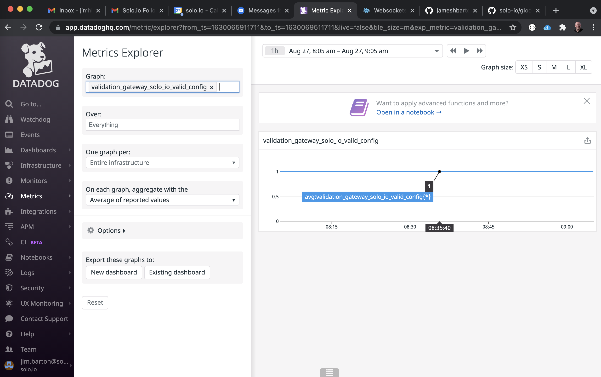
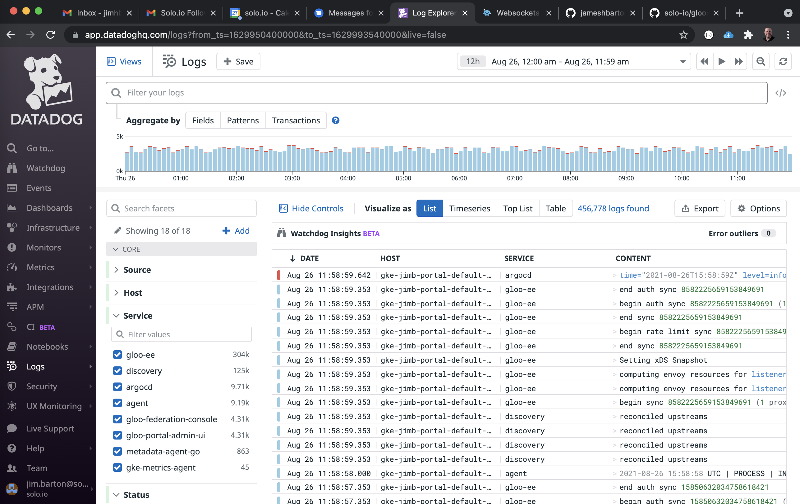

Datadog is a SaaS platform that allows you to easily collect metrics and events from your environment through integrations with solutions like Kubernetes, public cloud providers, Linux and more. In this guide, we will show you how Gloo Edge can work with the Datadog Kubernetes integration to deliver information from Envoy and other Gloo Edge components to Datadog for analysis.

Here are the high level steps for completing the integration:

1. Install Kubernetes and Envoy Integrations
1. Get the API key for Helm installation
1. Create and edit Datadog values file
1. Install Datadog using Helm
1. Update the gateway-proxy Deployment
1. Update the gateway-proxy ConfigMap
1. Validate using kubectl

---

## Prerequisites

You will need the following to complete this guide:

* **Datadog account**: If you don't already have an account, you can sign up for a free trial [on their website](https://app.datadoghq.com).
* **Kubernetes cluster**: This can be deployed in any environment, follow our [preparation guide]({}) for more information.
* **Gloo Edge installation**: You can install Gloo Edge on Kubernetes by following our [setup guide]({}).
* **Helm**: You will be deploying the Datadog integration using [Helm v3](https://helm.sh/docs/intro/install/).
* **kubectl**: Kubectl should be installed and configured to access the cluster where you are adding Datadog.

Once you have the prerequisites complete, you will need to get Datadog deployed on your Kubernetes cluster.

---

## Prepare Datadog

Now that we've got all the prerequisites in place, there are a few things to do on the Datadog side to prepare for data collection. We need to enable the Kubernetes and Envoy integrations and get the API key for the Kubernetes installation.

### Install Kubernetes and Envoy Integrations

From the Datadog portal, select [**Integrations**](https://app.datadoghq.com/account/settings#integrations). Then, install the **Envoy** and **Kubernetes** integrations.


If this is the first time you've logged into Datadog, you can also follow the wizard for enabling Kubernetes and Envoy.

### Retrieve the API key

From the Datadog portal, select **Integrations > Agents**. Then, select the [**Kubernetes** agent](https://app.datadoghq.com/account/settings#agent/kubernetes). In the directions, find the Helm command to install the Datadog agent on your cluster. Your API key is included in the sample command, similar to the following example.

```bash
helm install datadog-gloo -f datadog-values.yaml --set datadog.site='datadoghq.com' --set datadog.apiKey=YOUR_API_KEY --set datadog.prometheusScrape.enabled=true datadog/datadog 
```

Copy this command for later use.

---

## Install Datadog using Helm

You can use Helm to install Datadog on your Kubernetes cluster. As part of the installation, you create a file to override the default values in the Helm chart.

### Prepare the Datadog overrides file

Use the Datadog `values.yaml` configuration file as a starting point for your overrides file. For more information, see the [Datadog docs](https://docs.datadoghq.com/containers/kubernetes/installation/?tab=helm).

Update two `datadog.logs` settings:
* `enabled: true`: Enables log collection by Datadog.
* `containerCollectAll: true`: Enables log collection across all containers.

```yaml
cat << EOF >  datadog-values.yaml
datadog:
  logs:
    ## @param enabled - boolean - optional - default: false
    ## Enables this to activate Datadog Agent log collection.
    ## ref: https://docs.datadoghq.com/containers/kubernetes/log/
    #
    enabled: true

    ## @param containerCollectAll - boolean - optional - default: false
    ## Enable this to allow log collection for all containers.
    ## ref: https://docs.datadoghq.com/containers/kubernetes/log/
    #
    containerCollectAll: true
EOF
```

Now that the `datadog-values.yaml` file is ready, you can use Helm to deploy Datadog to your Kubernetes cluster.

### Install Datadog with Helm

You will need to log into your Datadog account to retrieve the API keys for your installation. We retrieved them in an earlier step. You can find the example Helm command with your API keys on the [Kubernetes integration page](https://app.datadoghq.com/account/settings#agent/kubernetes). 

Since we already prepared our `datadog-values.yaml` file in the previous step, we can simply run the following Helm command against the target Kubernetes cluster. Be sure to change the `YOUR_API_KEY` value to the key found in the example command in your Datadog account.

```bash
helm install datadog-gloo -f datadog-values.yaml --set datadog.site='datadoghq.com' --set datadog.apiKey=YOUR_API_KEY --set datadog.prometheusScrape.enabled=true datadog/datadog 
```

You can validate that Datadog has installed by checking for the deployed pods.

```bash
kubectl get pods | grep datadog
```

```console
datadog-gloo-6d7wk                                 1/1     Running   0          3m1s
datadog-gloo-cluster-agent-646f8f947d-sdm2z        1/1     Running   0          3m1s
datadog-gloo-j227x                                 1/1     Running   0          3m1s
datadog-gloo-kube-state-metrics-678b97d74f-w69jz   1/1     Running   0          3m1s
datadog-gloo-prn8j                                 1/1     Running   0          3m1s
```

The installation creates a `DaemonSet` for the Datadog agent, so there will be `datadog-gloo` pods for each worker node in your cluster, and separate pods for the `cluster-agent` and `kube-state-metrics`.

With Datadog installed, we now need to configure our Gloo Edge deployment to make Envoy metrics available to Datadog.

---

## Configure the Gloo Edge deployment

In this section, we will show you how to modify the Envoy proxy itself (`gateway-proxy` deployment) to provide its metrics to Datadog. In addition, by enabling the `prometheusScrape` option in the Datadog agent installation, we  expect to see control-plane-specific metrics emitted by other pods in the Gloo Edge fleet (e.g., gloo, discovery).

We will need to update two things to allow metrics collection from Datadog. In order to discover the Envoy pods, the Datadog agent is relying on an [Autodiscovery feature](https://docs.datadoghq.com/agent/kubernetes/integrations/?tab=kubernetes) that looks for specific annotations associated with Envoy pods. 

The Envoy pods are configured by default to listen on port 8081 and the path `/metrics`. When a request comes in matching that path, it is rewritten to `/stats/prometheus`. Since we want to use Datadog instead, we are going to update that rule to rewrite the path to just `/stats`. If you'd like to use both Prometheus and Datadog, you could set up a matcher for a different path and rewrite it to `/stats`.

### Updating the `gateway-proxy` annotations

First, we will publish metrics to Datadog for the Envoy proxy itself. To do this, we are going to edit the `gateway-proxy` deployment in Gloo Edge. We are going to add a series of Datadog-specific annotations that alert the agent that these pods are running Envoy. The annotations also let Datadog know what address to use for metrics collection and any log processing rules. The full list of potential annotations can be found in the [Datadog documentation](https://docs.datadoghq.com/agent/kubernetes/integrations/?tab=kubernetes).

Assuming that you have deployed Gloo Edge in the namespace `gloo-system`, run the following command:

```bash
kubectl edit deployments -n gloo-system gateway-proxy
```

Then update the `spec.template.metadata` section of the yaml with these additional annotations.  Be sure to add the annotations in the `spec.template.metadata.annotations` section, not the `metadata.annotations` section.  Adding them to the wrong section will cause the annotations not to be propagated through to the `gateway-proxy` pod.


The following code snippet uses the default name for the gateway in the Datadog annotations (`gateway-proxy`). If you have a multi-gateway deployment or changed the default name of the gateway, make sure to update the annotation to reflect this change. For example, if you changed the name of the gateway to `gloo`, then the Datadog annotations must follow the `ad.datadoghq.com/gloo.<datadog_config>` syntax. 



```yaml
spec:
  template:
    metadata:
      annotations:
        ad.datadoghq.com/gateway-proxy.check_names: '["envoy"]'
        ad.datadoghq.com/gateway-proxy.init_configs: '[{}]'
        ad.datadoghq.com/gateway-proxy.instances: '[{"stats_url": "http://%%host%%:8081/metrics"}]'
        ad.datadoghq.com/gateway-proxy.logs: '[{"source": "envoy", "service": "gloo","log_processing_rules":
         [{"type": "multi_line", "name": "log_start_with_date","pattern" : "^\\[[0-9]{4}-[0-9]{2}-[0-9]{2}|{"}]}]'
```

These annotations can also be added declaratively via helm, for example if using Gloo Edge Enterprise, these annotations can be added as a value for `gloo.gatewayProxies.gatewayProxy.podTemplate.extraAnnotations`.


If you upgrade the cluster using Helm version 3, these annotations should stay in place. Helm 3 uses a three-way merge when performing an update. Helm version 2 will also attempt a merge, but may have issues with changes made using kubectl edit. You should update the values used by Helm to include these annotations. Note that Helm 2 is not supported in Gloo Edge.


For more information about merging strategies, see the [Helm documentation](https://helm.sh/docs/faq/changes_since_helm2/#improved-upgrade-strategy-3-way-strategic-merge-patches).

You can verify that the annotations have been successfully updated by running the following command:

```bash
kubectl get pods -n gloo-system -l gloo=gateway-proxy -o json | jq '.items | .[].metadata.annotations'
```

### Updating the Envoy configuration

The configuration of the Envoy `gateway-proxy` is stored in a ConfigMap called `gateway-proxy-envoy-config`. We are going to update the ConfigMap to update the route on the Prometheus listeners. 

Assuming that you have deployed Gloo Edge in the namespace `gloo-system`, run the following command:

```bash
kubectl edit configmap gateway-proxy-envoy-config -n gloo-system
```

Find the following section in the ConfigMap:

```yaml
  route:
    prefix_rewrite: "/stats/prometheus"
    cluster: admin_port_cluster
```

And update it to the following:

```yaml
  route:
    prefix_rewrite: "/stats" # instead of "/stats/prometheus"
    cluster: admin_port_cluster
```

Then save the change. The Envoy pod will update within a few seconds with the new configuration settings. Datadog should now be able to collect metrics from any Envoy pods using the `/metrics` path.

If you'd prefer to manage the `route.prefix_rewrite` setting from Helm rather than directly editing the ConfigMap, then use the value `gatewayProxies.gatewayProxy.stats.routePrefixRewrite` as documented [here]({}).

---

## Validate the configuration

We can check that the Datadog agent has enabled Envoy metrics collection by running the `agent status` command against the daemonset pod that is on the same node as the `gateway-proxy` pod. First we can get the worker node in question by running:

```bash
NODE_NAME=$(kubectl get pods -n gloo-system -l gloo=gateway-proxy -o json | jq '.items | .[].spec.nodeName' -r)
```

Then we can get the `DaemonSet` pod for Datadog by running the following:

```bash
# Assumes that Datadog agent pods are running in the default namespace
POD_NAME=$(kubectl get pods -n default --field-selector spec.nodeName=$NODE_NAME --selector=app=datadog-gloo | tail -1 | cut -d' ' -f1)
```

Now you can run the `agent status` command from inside the Datadog agent pod:

```bash
kubectl exec $POD_NAME -- agent status | grep envoy
```

The output should be similar to this:

```console
envoy (1.23.0)
      Instance ID: envoy:f312c8247060dc62 [OK]
```

That means the Datadog agent has fired up the Envoy integration and should be collecting metrics. You can verify this by going back to the Datadog portal and navigating to the Envoy Overview dashboard.



In addition, you should be able to see meaningful statistics on the Datadog Metrics Explorer.



You should also be able to see log messages emitted by various Gloo Edge components.



---

## Summary

In this guide we showed you how to integrate Datadog with Gloo Edge and Envoy proxies. It's important to remember that the changes made to the gateway-proxy ConfigMap and Deployment should also be updated in the Helm values file you use to deploy Gloo Edge. This is especially important if you are using Helm version 2, which does not gracefully handle out-of-band changes. It is also possible to configure these settings before Gloo Edge is installed by using a custom values file with the Helm installation. 

The full list of Helm values is available in the [docs]({}). The value `gatewayProxies.gatewayProxy.podTemplate.extraAnnotations.NAME` can be updated to add the required annotations, and the value `gatewayProxies.gatewayProxy.stats.routePrefixRewrite` controls the `route.prefix_rewrite` above.
